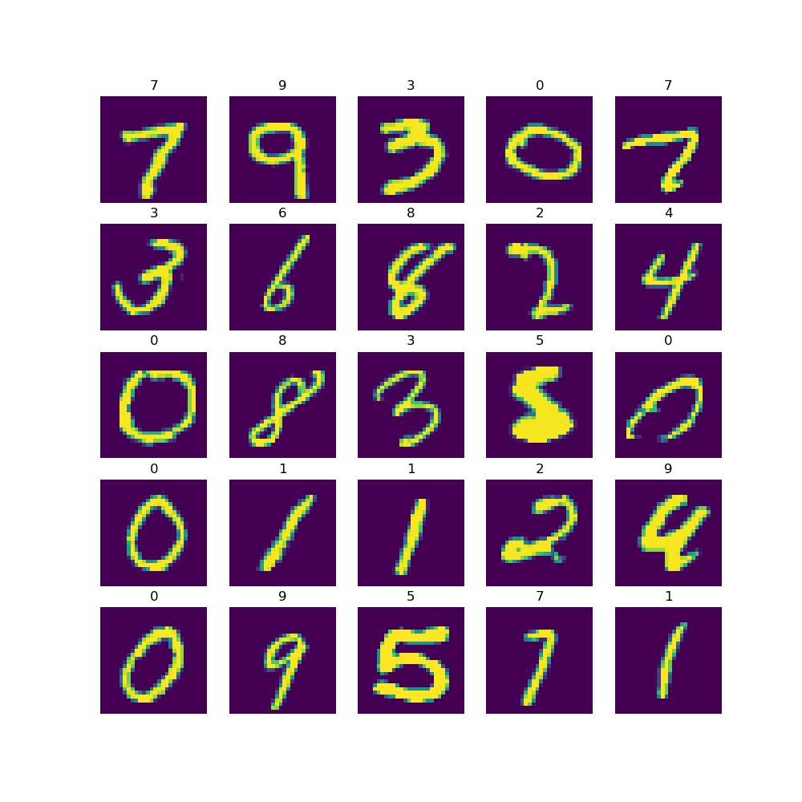
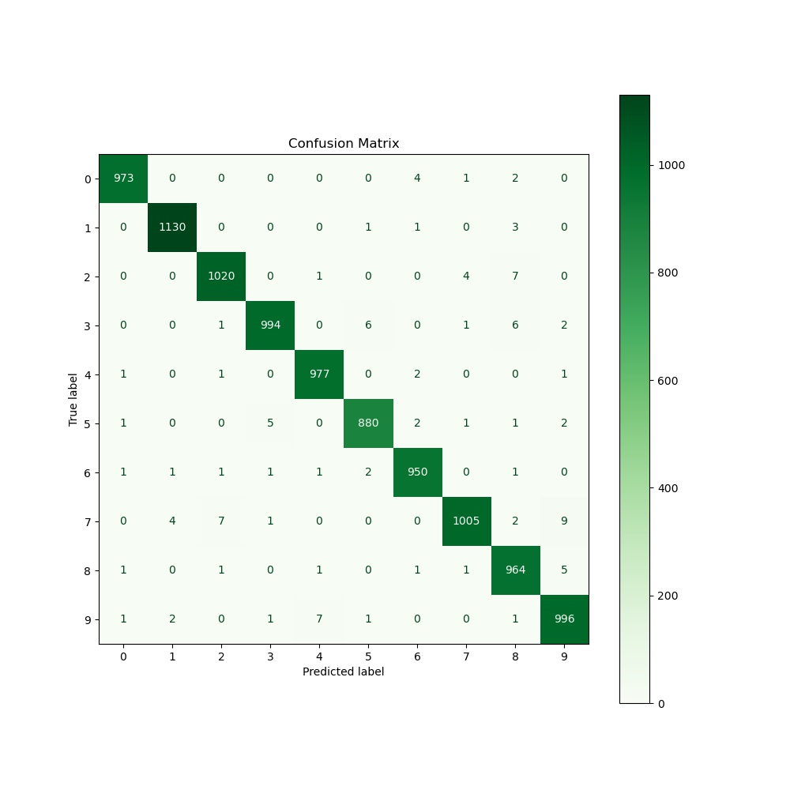
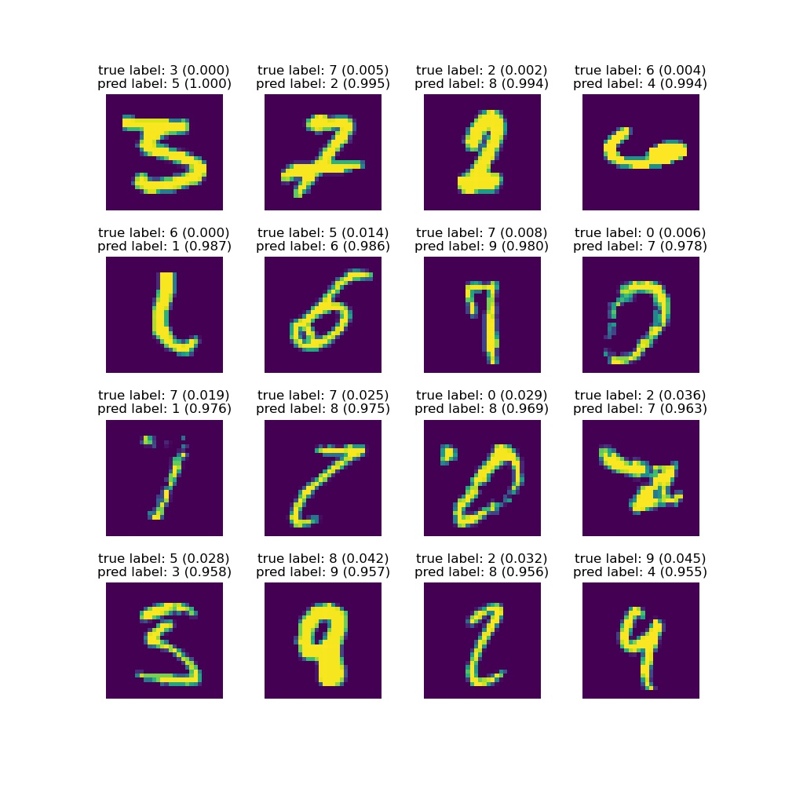

## MNIST experiments with PyTorch

This repo implements MNIST classification with PyTorch.

## Setup
- run `conda env create`: it will create the environment & get the dependencies from the `environment.yml` file.
- run `conda activate pytorch-mnist`

## How to use

Simply run `python main.py --model=<MODEL> --n_epochs=<N_EPOCHS> --small=<boolean>`

There are 3 types of models:
  - `simple`: simple feed-forward network
  - `conv`: CNN
  - `vgg`: VGG16 pretrained network

Use `small=True` to train the network with only 10% of the MNIST dataset (ie ~6000 images) for speed.

Example results after running `python main.py --model=conv --n_epochs=12`:\
**Test Loss: 0.034 |  Test Acc: 98.89%**

___

Some output images will be kindly generated in the `data/output-images` directory!

#### 1. Before training: random batch to have a look at the dataset

#### 2. After training: confusion matrix

#### 3. After training: most incorrectly classified images

## Tensorboard
You can optionally launch Tensorboard to look at some stats during training.
- run `tensorboard --logdir=runs --port=6006` in another terminal
- go to [http://localhost:6006](http://localhost:6006) and let the magic happen!

\
\
:v::rocket::rocket:
